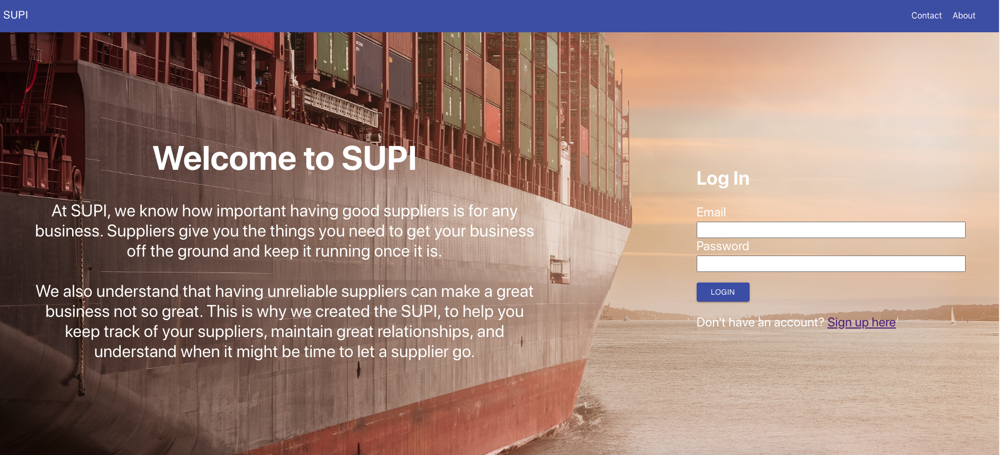
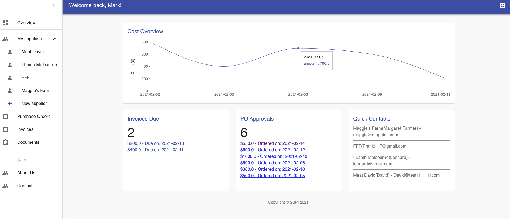
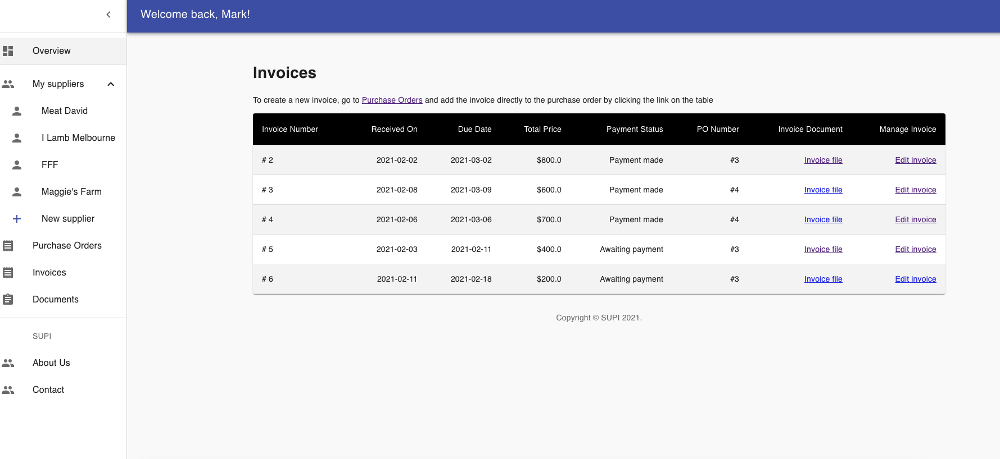
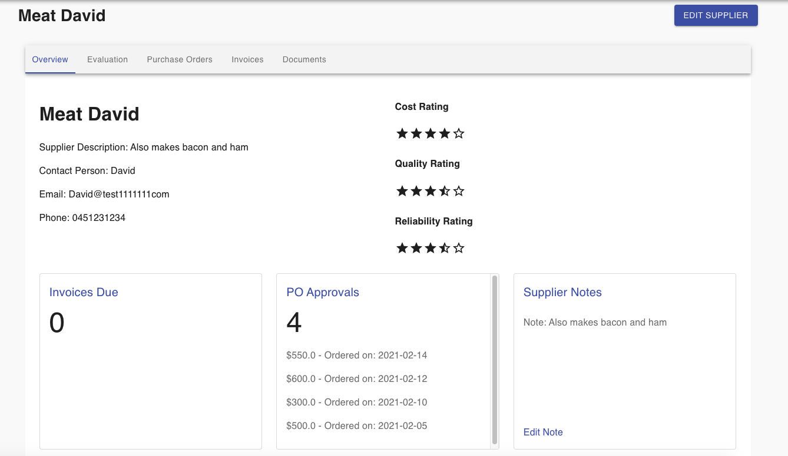
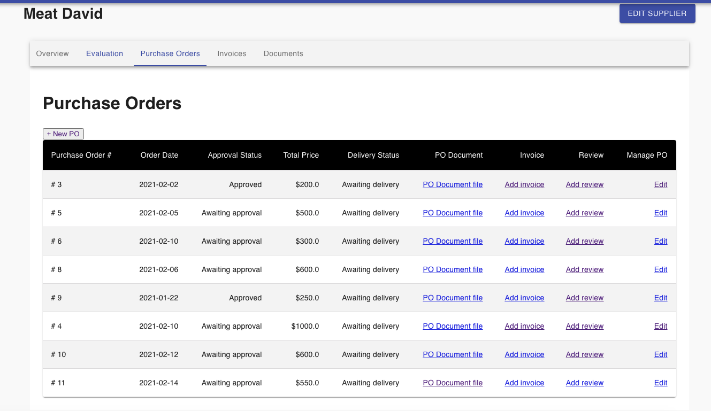

# SUPI - A supplier management system
Site Link: https://supi.netlify.app/. 

* Visit the site via the above url. You can use this demo account to see how the functions work. (username: mark@email.com; password: password).  
* When you sign up a new account, all fields must be filled in.  
* Feel free to play around with the app and any feedback is welcome!  

## Table of contents
* [General info](#general-info)
* [Screenshots](#screenshots)
* [Technologies](#technologies)
* [Features](#features)

## General info
A supplier management system for businesses in the catering industry. We hope that with this app, businesses will be able to visualise supplier performance, upcoming tasks and payments, and then help with making better operational choices.

## Screenshots
Landing page:  
     
Dashboard page:  
     
Company Invoices:  
     
Supplier Overview:  
     
Supplier Purchase Orders:  
     

## Technologies
* HTML  
* CSS
* JavaScript
* React
* Material-UI
* Netlify

## Features
1. Supplier tracking: business users can see all suppliers they are working with and supplier details such as what service they are offering, reviews on past works, and delivery period, etc.  
2. Performance tracking: business users can see ratings of each supplier's past works, using a chart to show an overview of the performance.  
3. Payment management: Purchase orders, invoices and payments(upcoming and completed) are managed. A budgeting management tool can visualise overall spending on each work and on each supplier.   
4. Document management: Supplier information such as vendor licenses and contracts will be stored.  
5. Some to-do features: Searching for suppliers on the market(requires an availavle API); Direct email function when clicking on the supplier contact email.

## Usage
* Clone this repo to your desktop, cd to the root directory and then run `yarn install` to install all dependencies.  
* Once the dependencies are installed, you can run `yarn start` to start the application. The app will be deploy at localhost:3001 as default. The backend urls are set in the .env.development and .env.production files respectively.  
* Check the cors.rb file and make sure your front end url is listed after the `origins` statement.  

